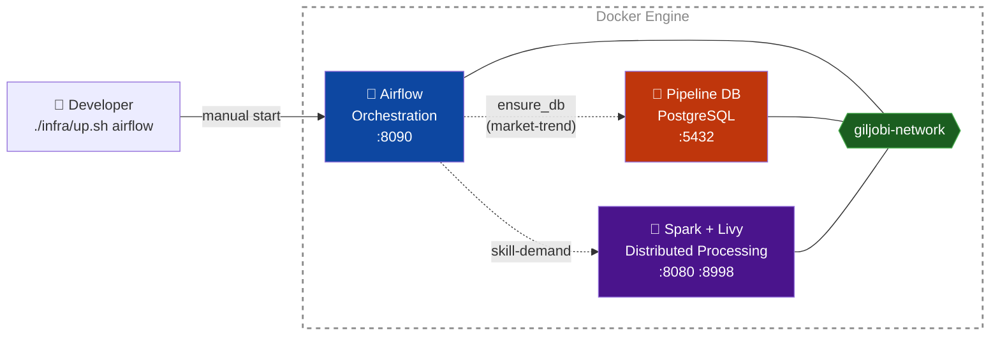
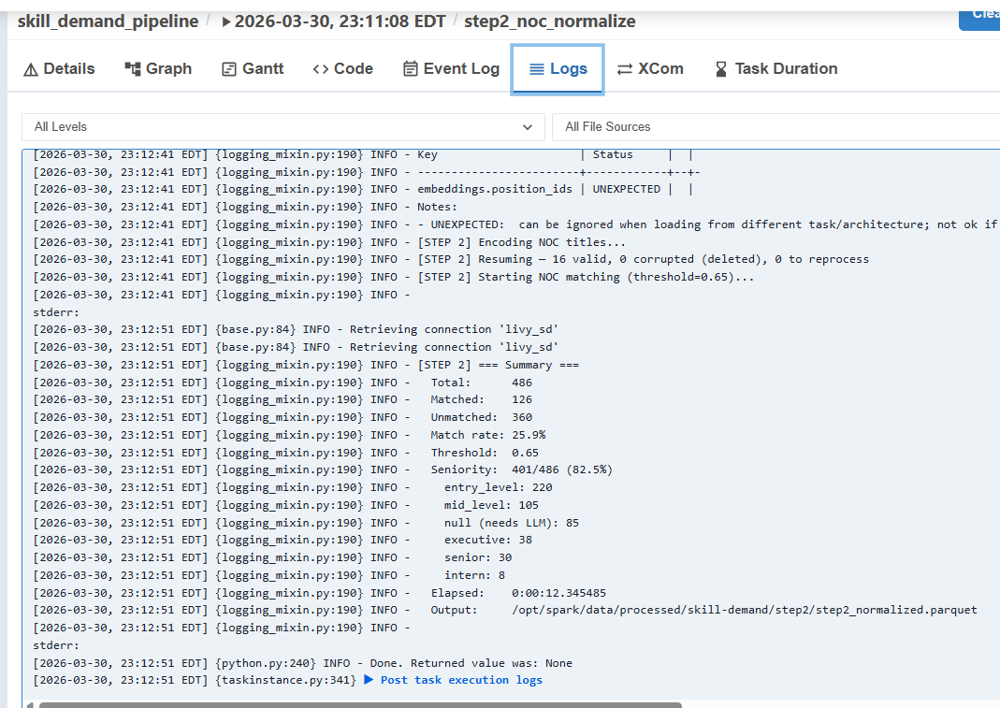
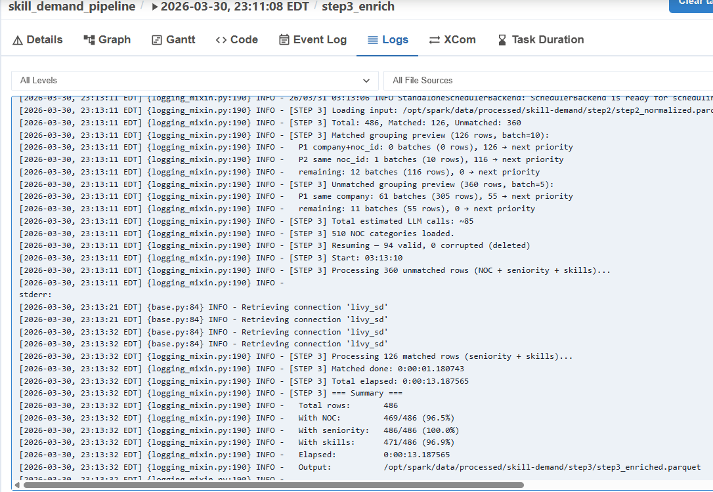
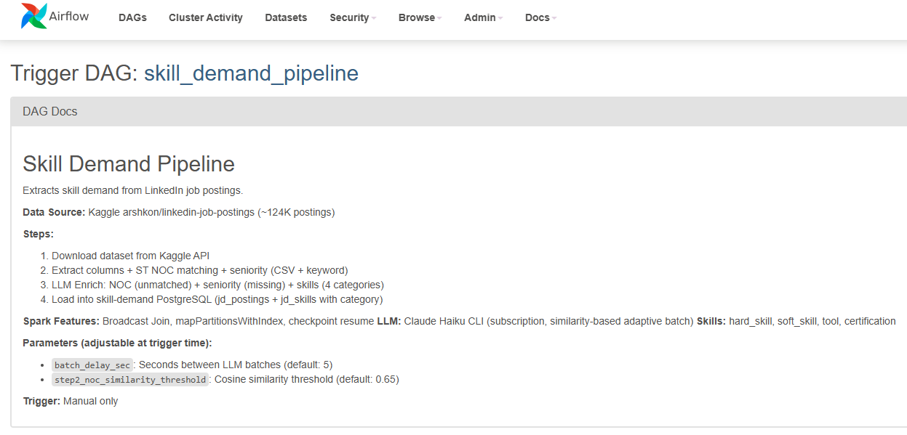

# GILJOBI : Skill Demand Analytics Platform

<p align="center">
  
</p>

A data engineering capstone project that processes job postings from Canada Job Bank and LinkedIn to provide career insights — market trends, salary distribution, and skill demand analysis.

## Project Overview

This platform processes job postings from two data sources:

- **Canada Job Bank Open Data** (~3.3M postings) — market trends, salary distribution, hiring locations, classified by NOC (National Occupational Classification) 2021
- **LinkedIn/Kaggle Dataset** (~123K postings) — skill extraction, job title normalization using LLM

DAG-managed modular infrastructure where Airflow orchestrates the entire data lifecycle — starting/stopping databases and Spark clusters as needed.

## Architecture

Only Airflow is started manually. DAGs manage all other infrastructure automatically.



For detailed architecture, see [infra/SPEC.md](infra/SPEC.md).

### Two-Stream Pipeline

| Stream | Source | Volume | Processing | Status |
|--------|--------|--------|------------|--------|
| **Market Trend** | Canada Job Bank Open Data | ~3.3M rows | Python + pandas | Completed |
| **Skill Demand** | LinkedIn/Kaggle | ~123K rows | Spark + Claude LLM | E2E verified on sample |

### Repo Structure

```
Giljobi-DataPipeline/
├── dags/                          # Airflow DAGs (one per stream)
│   ├── market_trend_dag.py
│   └── skill_demand_dag.py
├── pipelines/
│   ├── market-trend/              # Job Bank ETL — SPEC / RUNBOOK
│   └── skill-demand/              # LinkedIn pre-processing + LLM
├── infra/                         # Modular infrastructure — SPEC
└── data/                          # Local data (gitignored)
```

## Quick Start

```bash
# Start Airflow
./infra/up.sh airflow

# Open Airflow UI — trigger market_trend_pipeline DAG
# http://localhost:8090 (airflow / airflow)

# Stop
./infra/down.sh
```

Configuration (replicas, memory, cores, credentials) is in `infra/config/.env.development`.

## Market Trend Pipeline

### Via Airflow (recommended)

1. Start Airflow: `./infra/up.sh airflow`
2. Open Airflow UI: http://localhost:8090
3. Enable `market_trend_pipeline` DAG
4. Click "Trigger DAG" — DB starts automatically if not running


The DAG manages the full lifecycle:

`ensure_db` → [`noc_setup` + `scrape`] → `download` → `validate` → `transform` → `load`


For pipeline details, see [pipelines/market-trend/SPEC.md](pipelines/market-trend/SPEC.md).

### Via CLI (standalone)

```bash
cd pipelines/market-trend
py main.py                          # Full pipeline (local DB)
py main.py --db "postgresql://..."  # Custom DB (e.g., Neon)
```

See [pipelines/market-trend/RUNBOOK.md](pipelines/market-trend/RUNBOOK.md) for full documentation.

## Skill Demand Pipeline

Analyzes ~124K LinkedIn job postings to answer: **which skills are most demanded per occupation and seniority level?**

| Step | Processing | Technology |
|---|---|---|
| Step 1 | Extract columns from CSV | Pandas |
| Step 2 | NOC occupation matching + seniority detection | PySpark + Sentence Transformers |
| Step 3 | LLM enrichment — NOC (unmatched) + seniority (missing) + skills (4 categories) | PySpark + Claude Haiku CLI |
| Step 4 | Load into PostgreSQL | psycopg2 |

**Skill Categories:** `hard_skill` (Python, data modeling) · `soft_skill` (communication, leadership) · `tool` (Excel, AWS, Docker) · `certification` (CPA, PMP)

### DAG Overview


### DAG Graph — Full Pipeline

E2E pipeline verified on 486-row sample. All tasks green. Dynamic worker scaling between Step 2 (4 workers, memory-heavy) and Step 3 (8 workers, IO-heavy).


### DAG Graph — Step 3 Detail

Step 3 (LLM Enrich) processes all rows with similarity-based adaptive batching. `scale_workers_step3` scales to 8 workers before execution. `step3_enrich` hover shows task duration and status.


### Configurable Parameters

All parameters adjustable at trigger time via Airflow UI — no code changes needed.

| Parameter | Default | Purpose |
|---|---|---|
| `step2_input_file` | `step1_extracted_sample.parquet` | [Test only] Switch between sample and full dataset |
| `step2_noc_similarity_threshold` | `0.65` | Minimum cosine similarity to accept a NOC match |
| `step2_workers` / `step3_workers` | `4` / `8` | Spark worker count per step (dynamic scaling) |
| `step2_executor_memory` / `step3_executor_memory` | `2g` / `512m` | Step 2 is memory-heavy (ST model), Step 3 is IO-heavy (LLM) |
| `step2_partitions` | `16` | Checkpoint granularity (~8K rows each at 124K) |
| `batch_delay_sec` | `5` | Seconds between LLM calls (rate limiting) |


### Step 2 — Sentence Transformers NOC Matching + Seniority

Checkpoint resume with validation: `16 valid, 0 corrupted, 0 to reprocess`. NOC match rate 25.9%, seniority 82.5% (CSV + title keyword, no LLM).



### Step 3 — LLM Enrich (NOC + Seniority + Skills)

Similarity-based adaptive batch grouping, checkpoint resume with corrupted detection. Final: NOC 96.5%, seniority 100%, skills 96.9% (avg 7.7 skills/posting).



### DAG Documentation

Pipeline description rendered in Airflow UI via `doc_md`.



For full pipeline specification, see [pipelines/skill-demand/SPEC.md](pipelines/skill-demand/SPEC.md).

## Technology Stack

- **Data Processing**: Apache Spark (PySpark), Pandas
- **LLM**: Claude API (job title normalization)
- **Orchestration**: Apache Airflow (CeleryExecutor)
- **Storage**: PostgreSQL (Neon DB for production), Docker volumes
- **Infrastructure**: Docker Compose (modular), Docker-in-Docker (DAG-managed)
- **Languages**: Python 3

---

**Team**: 3 members | **Timeline**: 4 months | **Status**: Active Development
