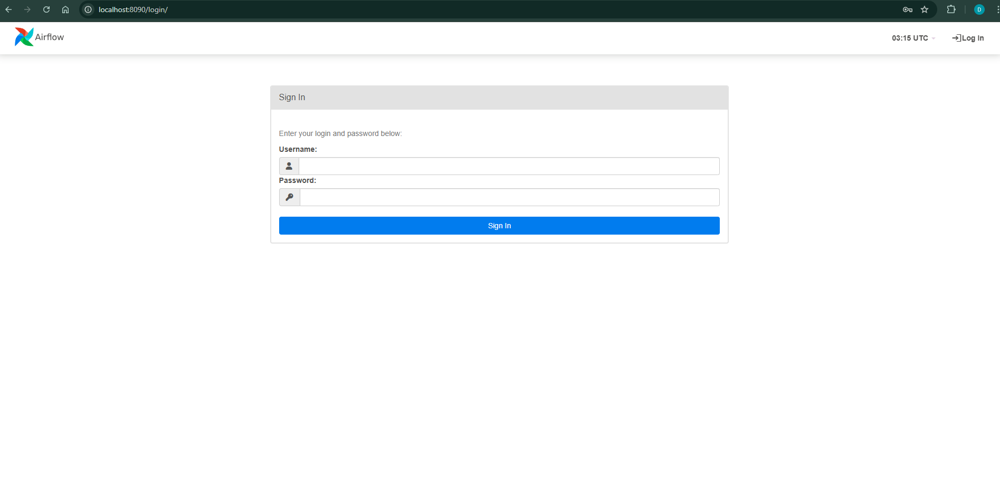
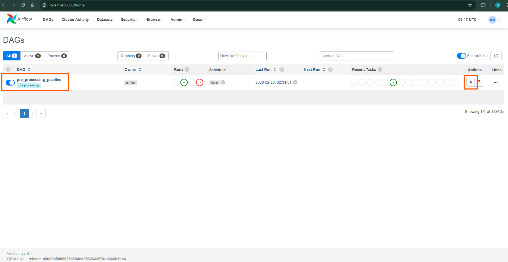
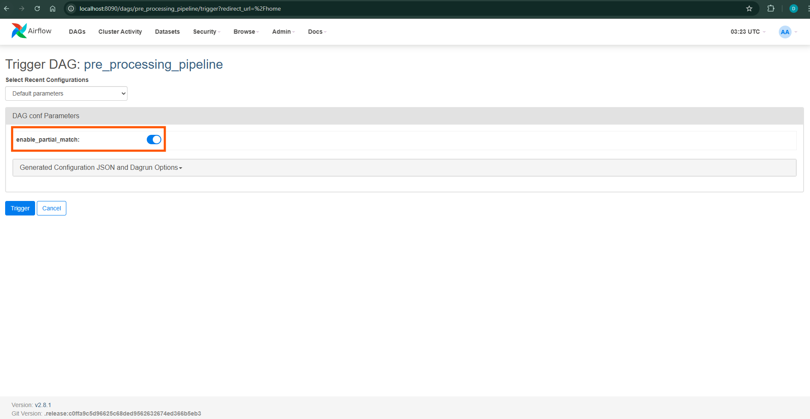
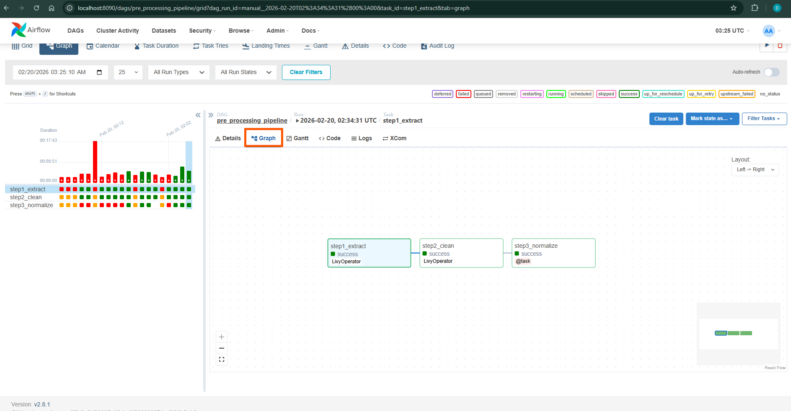

# GILJOBI : Skill Demand Analytics Platform

<p align="center">
  
</p>

A data engineering capstone project that analyzes job postings from major platforms (e.g., LinkedIn, Indeed) to provide career insights using Apache Spark and LLM-based data processing.

## 📋 Project Overview

This platform processes historical job postings to help job seekers understand:

- Market share by job role
- Seniority distribution (Entry/Mid/Senior/Lead)
- Top required skills per role
- [Optional] Geographic distribution of opportunities

**Key Innovation:** LLM-powered job title normalization that learns from actual data patterns, and multi-threading process using Apache Spark.

## How To Start Containers

```bash
docker compose up -d
```

## How To Run Pre-Processing Jobs on Airflow

> Airflow/Spark/Livy containers should be up.

1. Open Airflow UI at localhost

```bash
http://localhost:8090
```



### Login credentials

- Username: _airflow_
- Password: _airflow_

2. Select and run a DAG from the DAG list



3. Set `enable_partial_match` to enable partial matching in step 3



4. Monitor each step's progress in the **Graph** tab



## How To Run Pre-Processing Jobs on CLI

> Spark containers should be up.

1. Access the Spark master container

```bash
docker exec -it spark-master bash
```

2. Run python scripts for each processing step

```bash
/opt/spark/bin/spark-submit /opt/spark/notebooks/<python-file>
```

- Example for Step 1:

```bash
/opt/spark/bin/spark-submit /opt/spark/notebooks/step1_select_colums.py
```

3. Convert parquet into csv (optional)

```bash
/opt/spark/bin/spark-submit /opt/spark/notebooks/parquet_to_csv.py --input /opt/spark/data/processed/step1_selected --output /opt/spark/data/processed/step1_selected/preview_csv_small
```

4. Upload parquet to SQL server

```bash
/opt/spark/bin/spark-submit \
    --master spark://spark-master:7077 \
    --jars /opt/spark/jars/custom/postgresql-42.7.1.jar \
    /opt/spark/notebooks/upload_to_postgres.py \
    --input /opt/spark/data/processed/<parquet_file> \
    --mode append
    --enable-partial-match
```

## 🎯 Core Features

### Rule-Based Data Pre-Processing

- Pre-process the dataset to extract senority and pre-normalize obvious titles, eventually to reduce LLM resources used.

### Intelligent Title Normalization

- Consolidates title variations using LLM
  - "Software Engineer", "SWE", "SDE II" → "Software Engineer"
  - "Backend Engineer", "Backend Developer" → "Backend Engineer"

### Tag-based Classification

- **Primary tags**: Base roles (e.g., "Software Engineer", "Data Scientist") using [O\*NET](https://www.onetonline.org/) job classification.
- **Secondary tags**: Specializations (e.g., "Backend", "AI/ML", "Cloud")
- Enables flexible querying: Find all "Software Engineer" roles OR all roles with "AI/ML" tag

**Benefits:**

- ✅ Scalable: LLM cost only for unique titles
- ✅ Data-driven: Learns from actual job market
- ✅ Fast: Production normalization uses simple lookups

## 🛠️ Technology Stack

- **Data Processing**: Apache Spark (PySpark), Pandas
- **LLM**: Claude API (development)
- **Storage**: SQLite (development), PostgreSQL (planned)
- **Languages**: Python 3
- **Environment**: Docker, Git & GitHub

## 🎓 Learning Outcomes

This project demonstrates:

- **Large-scale data processing** with Apache Spark on 120K+ records
- **LLM integration** for intelligent data normalization
- **Production-grade ETL pipelines** with clear separation of concerns
- **Trade-offs**: Balancing accuracy vs. efficiency (LLM vs. rule-based approaches)
- **Real-world problem solving**: Handling messy data, inconsistent naming, and scalability

---

**Team**: 3 members | **Timeline**: 4 months | **Status**: 🚧 Active Development
