# GILJOBI : Skill Demand Analytics Platform

<p align="center">
  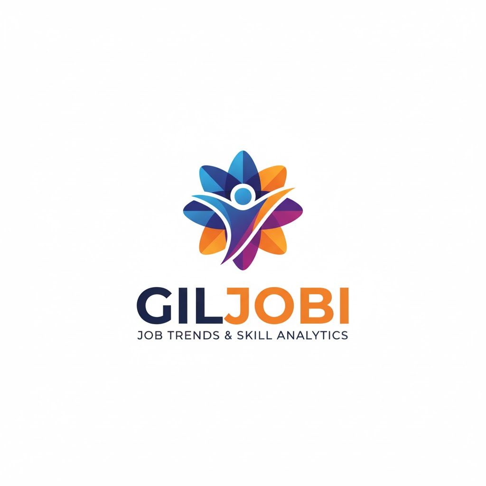
</p>

A data engineering capstone project that processes job postings from Canada Job Bank and LinkedIn to provide career insights — market trends, salary distribution, and skill demand analysis.

## Project Overview

This platform processes job postings from two data sources:

- **Canada Job Bank Open Data** (~3.3M postings) — market trends, salary distribution, hiring locations, classified by NOC (National Occupational Classification) 2021
- **LinkedIn/Kaggle Dataset** (~123K postings) — skill extraction, job title normalization using LLM

DAG-managed modular infrastructure where Airflow orchestrates the entire data lifecycle — starting/stopping databases and Spark clusters as needed.

## Architecture

Only Airflow is started manually. DAGs manage all other infrastructure automatically.

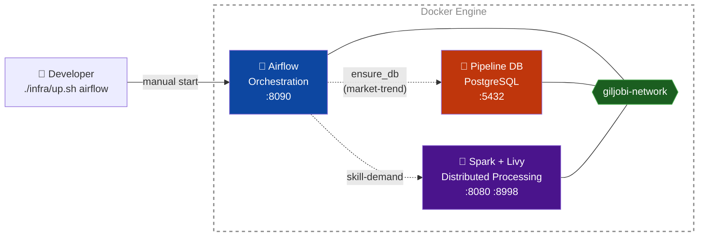

For detailed architecture, see [infra/SPEC.md](infra/SPEC.md).

### Two-Stream Pipeline

| Stream | Source | Volume | Processing | Status |
|--------|--------|--------|------------|--------|
| **Market Trend** | Canada Job Bank Open Data | ~3.3M rows | Python + pandas | Completed |
| **Skill Demand** | LinkedIn/Kaggle | ~124K rows | Spark + Claude LLM + Star Schema | In progress (~21% loaded) |

### Repo Structure

```
Giljobi-DataPipeline/
├── dags/                          # Airflow DAGs (one per stream)
│   ├── market_trend_dag.py
│   └── skill_demand_dag.py
├── pipelines/
│   ├── market-trend/              # Job Bank ETL — SPEC / RUNBOOK
│   └── skill-demand/              # LinkedIn pre-processing + LLM
├── infra/                         # Modular infrastructure — SPEC
└── data/                          # Local data (gitignored)
```

## Quick Start

```bash
# Start Airflow
./infra/up.sh airflow

# Open Airflow UI — trigger market_trend_pipeline DAG
# http://localhost:8090 (airflow / airflow)

# Stop
./infra/down.sh
```

Copy `infra/config/.env.example` to the ignored `infra/.env`, then supply local credentials and configuration there.

## Market Trend Pipeline

### Via Airflow (recommended)

1. Start Airflow: `./infra/up.sh airflow`
2. Open Airflow UI: http://localhost:8090
3. Enable `market_trend_pipeline` DAG
4. Click "Trigger DAG" — DB starts automatically if not running

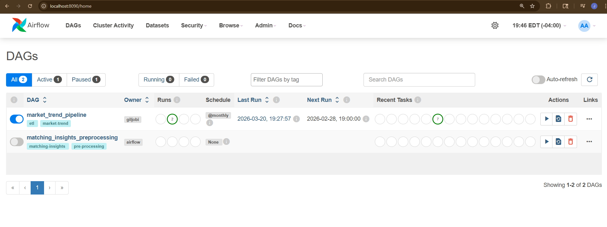

The DAG manages the full lifecycle:

`ensure_db` → [`noc_setup` + `scrape`] → `download` → `validate` → `transform` → `load`

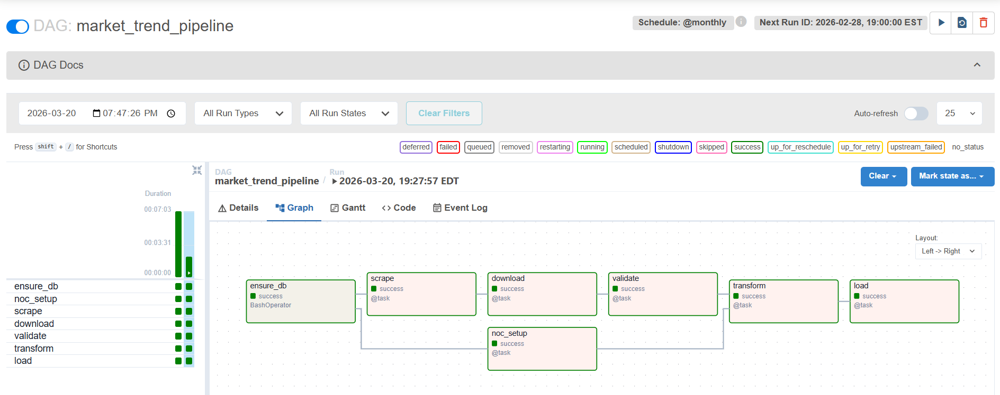

For pipeline details, see [pipelines/market-trend/SPEC.md](pipelines/market-trend/SPEC.md).

### Via CLI (standalone)

```bash
cd pipelines/market-trend
py main.py                          # Full pipeline (local DB)
py main.py --db "postgresql://..."  # Custom DB (e.g., Neon)
```

See [pipelines/market-trend/RUNBOOK.md](pipelines/market-trend/RUNBOOK.md) for full documentation.

## Skill Demand Pipeline

Analyzes ~124K LinkedIn job postings to answer: **which skills are most demanded per occupation and seniority level?**

### Pipeline Architecture

```
Download → Extract → [Bridge 1→2] → NOC Match + Seniority → [Bridge 2→3] → LLM Enrich → [Bridge 3→4] → Normalize + Load → [Final Summary]
```

| Step | Stage | Processing | Technology |
|---|---|---|---|
| Step 1 | Extract | Select columns, drop nulls → parquet | Pandas |
| Step 2 | Transform | NOC matching (cosine ≥ 0.65) + seniority (CSV/keyword) | PySpark + all-MiniLM-L6-v2 |
| Step 3 | Transform | LLM enrichment: NOC + seniority + skills (Driver batch factory, session control) | PySpark + Claude Haiku CLI |
| Step 4 | Transform + Load | Skill normalization (inflect + category vote) → Star Schema (COPY bulk) | psycopg2 + inflect |

**Skill Categories:** `hard_skill` (Python, data modeling) · `soft_skill` (communication, leadership) · `tool` (Excel, AWS, Docker) · `certification` (CPA, PMP)

### Star Schema (Data Warehouse)

Full rebuild each run. COPY bulk insert for performance.

| Table | Type | Description |
|---|---|---|
| `dim_companies` | Dimension | Unique company names |
| `dim_skills` | Dimension | Normalized skills (plural→singular, category majority vote) |
| `dim_seniority` | Dimension | 5 levels: intern, entry_level, mid_level, senior, executive |
| `noc_titles` | Dimension | Canadian NOC 2021 (510 unit groups) |
| `fact_job_postings` | Fact | One row per posting, FK to all dimensions |
| `fact_job_skill_demand` | Fact | One row per posting × skill, PK (job_id, skill_id) |
| `skill_demand_summary` | View | NOC × seniority × skill → demand_count |

### DAG Overview


### DAG Graph — Full Pipeline

16 tasks with bridge pattern: each bridge reviews previous step + scales workers + previews next step. Dynamic worker scaling between Step 2 (4 workers, 2g memory-heavy) and Step 3 (8 workers, 512m IO-heavy).

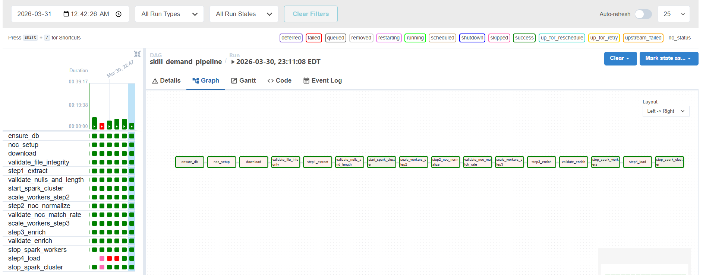

### Step 2 — NOC Matching + Seniority

Sentence Transformers cosine similarity (≥ 0.65) for NOC matching + CSV/keyword-based seniority extraction. Broadcast Join: 510 NOC embeddings to all executors.

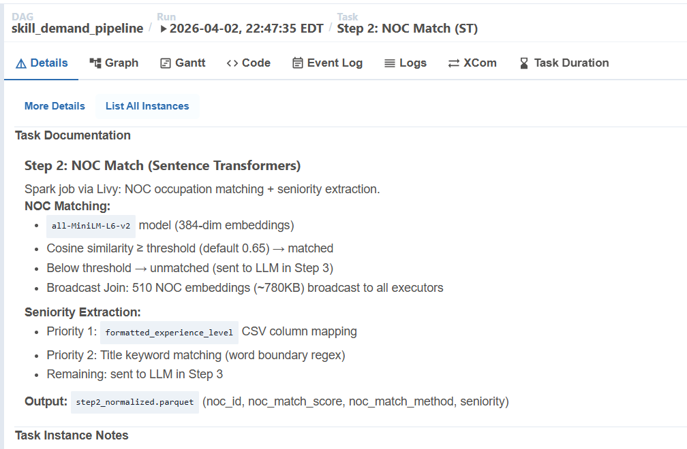

Checkpoint resume with partition-level validation. NOC match rate ~27%, seniority ~82% (CSV + keyword, no LLM).

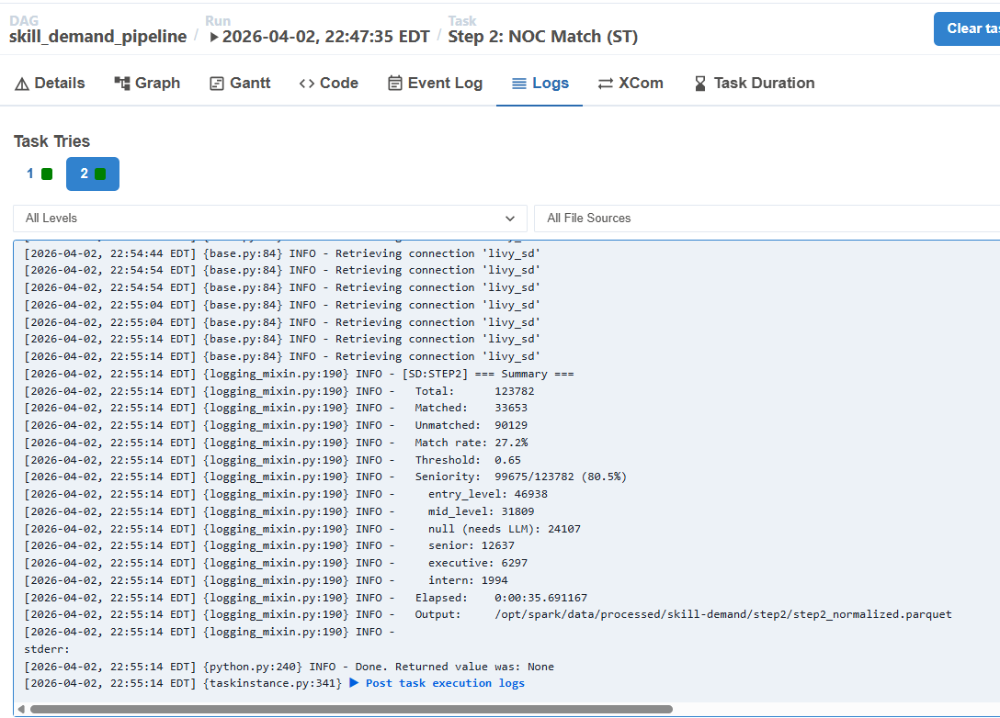

### Step 3 — LLM Enrich

Driver Batch Factory architecture: batches created on Driver with content-based batch_id (MD5 hash of job_ids). Workers only execute LLM calls. Session control at Driver level — exact batch count per session.

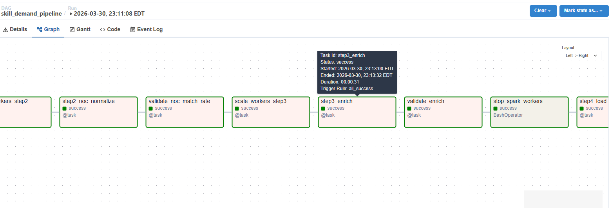

Adaptive grouping preview + session estimation + real-time progress with batch count.

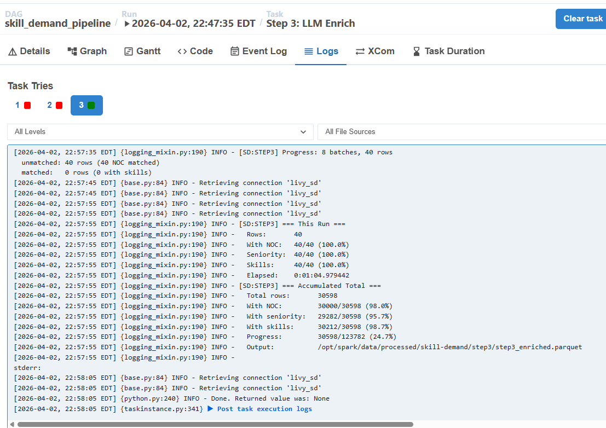

### Step 4 — Star Schema Load

Skill normalization (inflect plural→singular + category majority vote) + quality filter + COPY bulk insert. Full rebuild each run (data warehouse pattern).

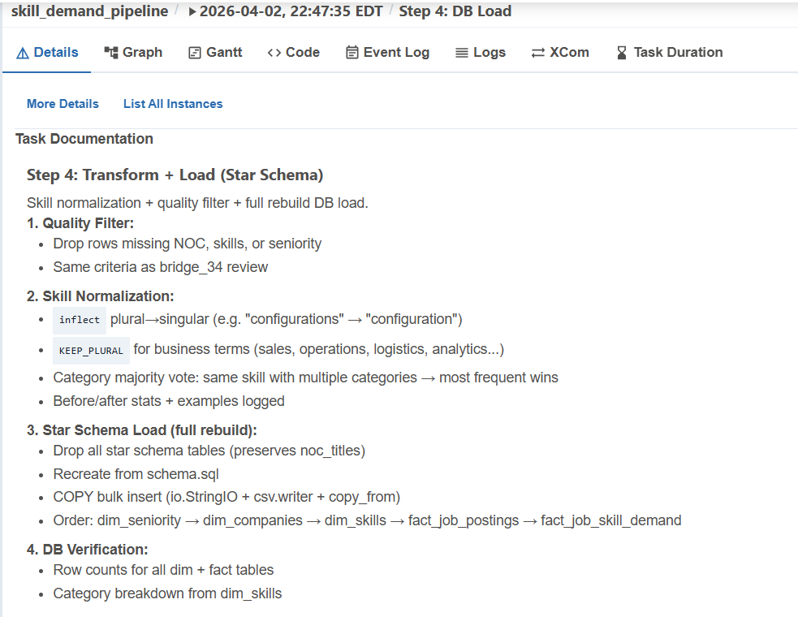

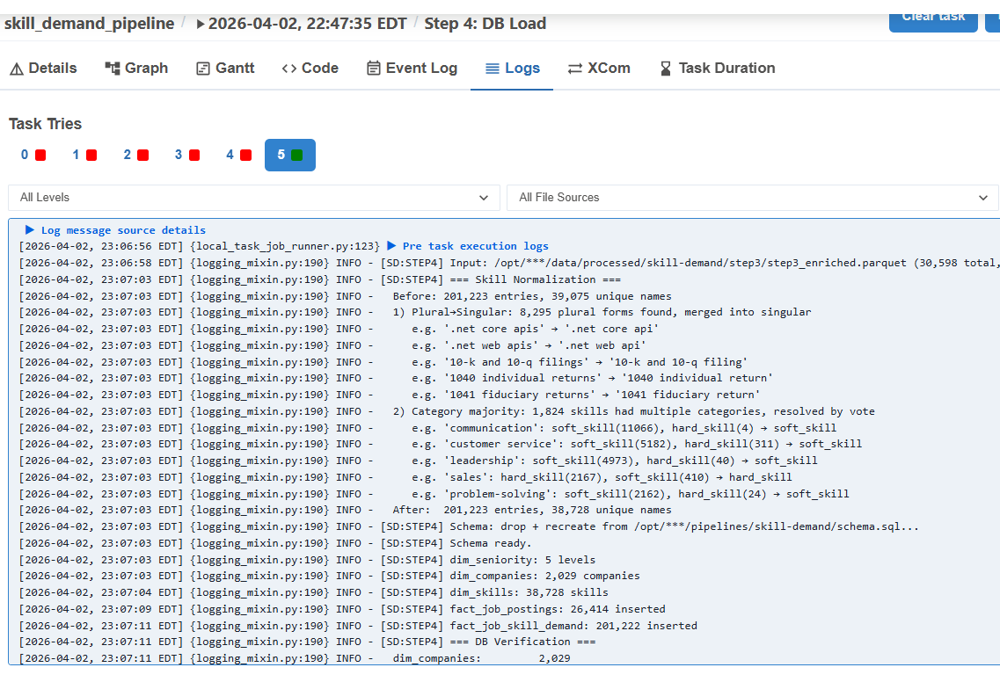

### Final Summary

Pipeline completion report with total dataset progress, quality filter breakdown, star schema stats, top skills, and sample postings.

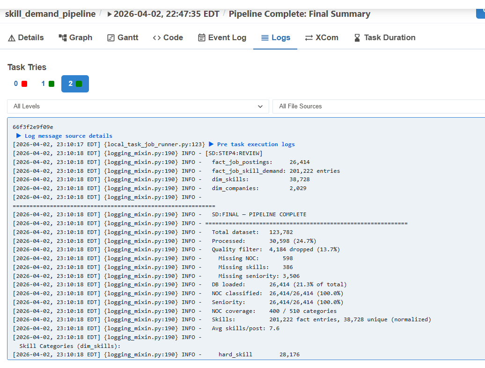

### Configurable Parameters

All parameters adjustable at trigger time via Airflow UI.

| Parameter | Default | Purpose |
|---|---|---|
| `step2_input_file` | (required) | Parquet filename — `step1_extracted.parquet` (production) |
| `max_batches_per_session` | `800` | LLM calls before cooldown (1 session ≈ 1,771 calls) |
| `session_cooldown_min` | `90` | Minutes to wait between sessions |
| `max_sessions` | `0` | Session limit (0 = unlimited, remaining resume on next trigger) |
| `step2_noc_similarity_threshold` | `0.65` | Minimum cosine similarity for NOC match |
| `step2_workers` / `step3_workers` | `4` / `8` | Spark worker count per step |
| `step2_executor_memory` / `step3_executor_memory` | `2g` / `512m` | Memory per executor |
| `batch_delay_sec` | `5` | Seconds between LLM calls |

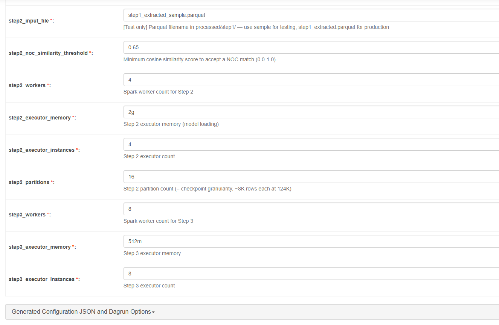

For full pipeline specification, see [pipelines/skill-demand/SPEC.md](pipelines/skill-demand/SPEC.md).

## Technology Stack

- **Data Processing**: Apache Spark (PySpark), Pandas
- **LLM**: Claude Haiku CLI (NOC matching, skill extraction via subscription)
- **NLP**: Sentence Transformers (all-MiniLM-L6-v2), inflect (skill normalization)
- **Orchestration**: Apache Airflow (CeleryExecutor, bridge task pattern)
- **Storage**: PostgreSQL (Star Schema — dim/fact tables), Docker volumes
- **Infrastructure**: Docker Compose (modular), Docker-in-Docker (DAG-managed)
- **Languages**: Python 3

---

**Team**: 3 members | **Timeline**: 4 months | **Status**: Active Development
