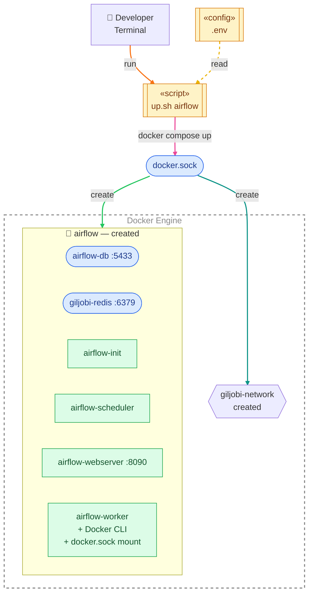
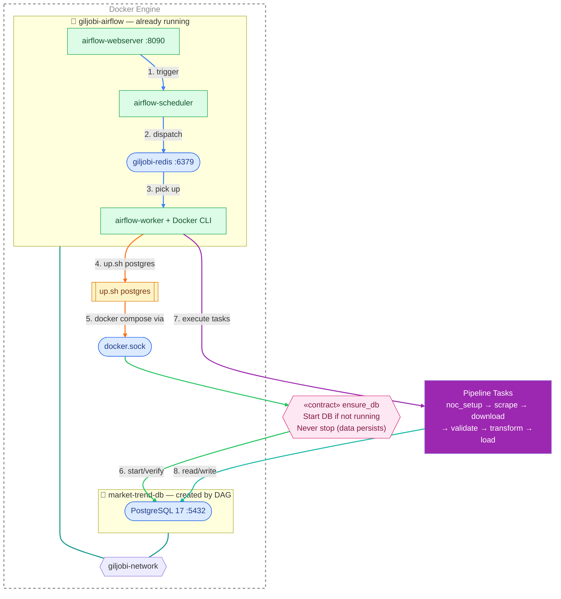
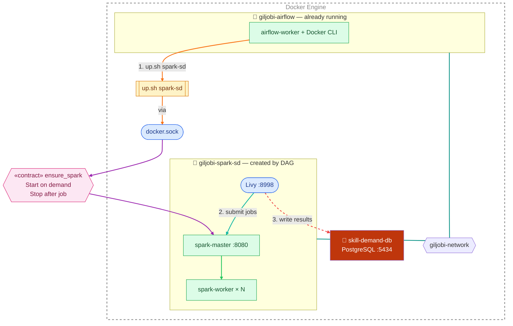
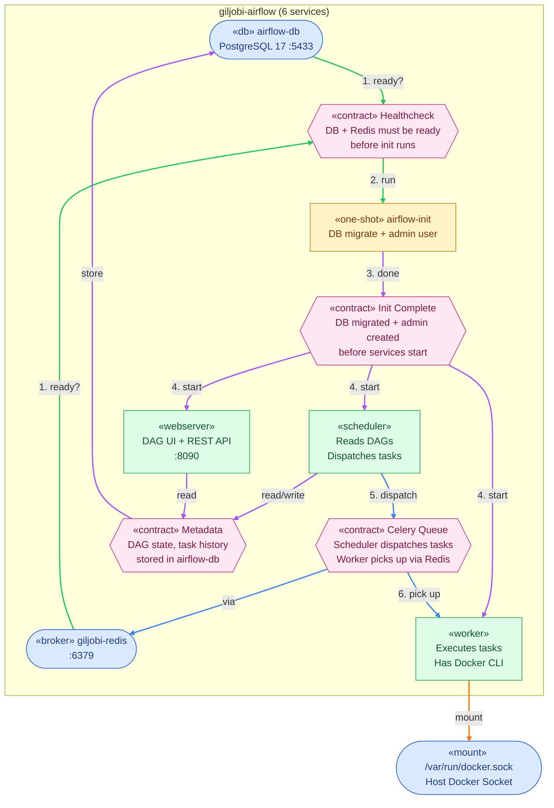
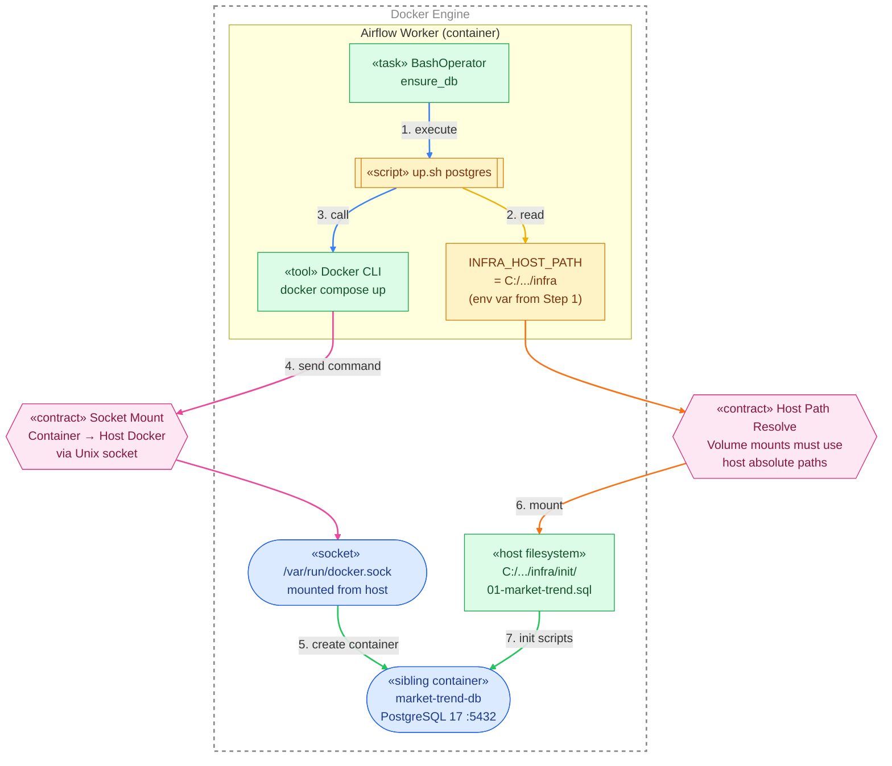
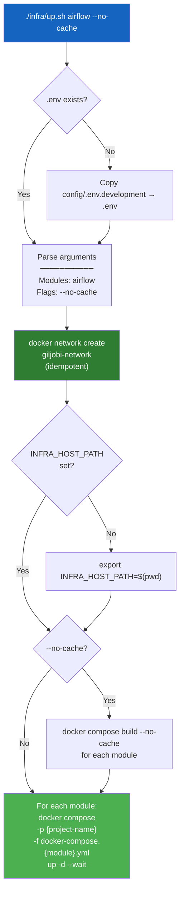

# Infrastructure Specification

## Architecture Overview

Three modular Docker Compose files connected via a shared network. Only Airflow is started manually — DAGs manage all other infrastructure.

### How Docker Engine works

All containers are managed by a single **Docker Engine** (daemon process) running on the host machine.
Commands like `docker compose up` don't create containers directly — they send requests to Docker Engine via a **Unix socket file** (`/var/run/docker.sock`).

```
Developer terminal                    Docker Engine (daemon)
      │                                      │
      ├── docker compose up ──────────────►  │ ← listens on docker.sock
      │   (Docker CLI)        via socket     │
      │                                      ├── creates containers
      │                                      ├── creates networks
      │                                      ├── mounts volumes
      │                                      └── manages lifecycle
```

This is how Airflow worker can control infrastructure: it has Docker CLI installed and the host's `docker.sock` mounted inside the container. When the worker runs `up.sh postgres`, Docker CLI sends the request through the mounted socket to the **same Docker Engine** on the host — creating sibling containers (not nested ones).

### Step 1: Manual Startup — `./infra/up.sh airflow`

The only manual step. Creates Airflow and all its internal services.



### Step 2a: DAG Execution — Market Trend Stream

When `market_trend_pipeline` DAG is triggered. Spark is **not used** — only DB.



### Step 2b: DAG Execution — Skill Demand Stream

When `skill_demand_pipeline` DAG is triggered. Uses Spark + separate DB (port 5434).



---

## Why This Layer Design?

### Problem

The original `docker-compose.yml` had **13 services in one file**. Starting anything meant starting everything — Spark clusters for a pipeline that only needed pandas, Celery workers when no tasks were queued.

### Solution: Modular Compose + DAG-Managed Lifecycle

Each compose file is an independent module. Streams pick only what they need:

| Module | Compose File | Lifecycle | Used by |
|--------|-------------|-----------|---------|
| **Airflow** | `docker-compose.airflow.yml` | Always on (manual start) | All streams |
| **Pipeline DB** | `docker-compose.postgres.yml` | ensure pattern (DAG starts, never stops) | market-trend |
| **Skill Demand DB** | `docker-compose.postgres-sd.yml` | ensure pattern (DAG starts, never stops) | skill-demand |
| **Spark + Livy** | `docker-compose.spark-sd.yml` | On-demand (DAG starts, DAG stops) | skill-demand only |

### What each stream uses

| Stream | Airflow | Pipeline DB | Spark |
|--------|:-------:|:-----------:|:-----:|
| **market-trend** | yes | yes (postgres) | no |
| **skill-demand** | yes | yes (postgres-sd) | yes (spark-sd) |
| *future stream* | yes | maybe | maybe |

### Benefits

- **No unnecessary services** — market-trend doesn't start Spark or skill-demand DB (saves 8GB+ RAM)
- **Independent scaling** — Airflow workers for I/O, Spark workers for compute
- **Failure isolation** — Spark crash doesn't take down Airflow or DB
- **Config-driven** — change replicas/memory in `.env`, no compose file edits
- **Stream independence** — each DAG declares what infrastructure it needs
- **Rebuild isolation** — rebuild Airflow image without touching Spark or DB

---

## Shared Infrastructure

### Airflow — Orchestration Layer

`docker-compose.airflow.yml` — Always on. The brain of the system.



#### Services

| Service | Image | Port | Purpose |
|---------|-------|------|---------|
| `airflow-db` | postgres:17 | 5433 | Airflow metadata (DAG state, task history, users) |
| `giljobi-redis` | redis:latest | 6379 | Celery message broker |
| `airflow-webserver` | custom (Dockerfile) | 8090 | DAG UI, REST API |
| `airflow-scheduler` | custom (Dockerfile) | — | DAG parsing, task scheduling |
| `airflow-worker` | custom (Dockerfile) | — | Task execution (scalable replicas) |
| `airflow-init` | custom (Dockerfile) | — | One-shot: DB migration + admin user creation |

#### Airflow Worker Capabilities

The worker has special capabilities beyond standard Airflow:

- **Docker CLI installed** — can run `docker compose` commands
- **Docker socket mounted** — controls host Docker daemon
- **infra/ mounted** — access to `up.sh`, `down.sh`, compose files
- **pipelines/ mounted** — executes pipeline Python code directly
- **data/ mounted** — reads/writes raw and processed data

#### Volumes

| Mount | Container Path | Purpose |
|-------|---------------|---------|
| `../dags/` | `/opt/airflow/dags` | DAG files (one per stream) |
| `../pipelines/` | `/opt/airflow/pipelines` | All stream source code |
| `../data/` | `/opt/airflow/data` | Raw + processed data |
| `./` | `/opt/airflow/infra` | up.sh, down.sh, compose files |
| `./logs/` | `/opt/airflow/logs` | Airflow task logs |
| `/var/run/docker.sock` | `/var/run/docker.sock` | Host Docker control |

### Docker-in-Docker Architecture

Airflow worker is a container that controls the host's Docker Engine to create sibling containers (not nested).
Docker CLI inside the worker sends commands through the mounted `docker.sock` — a Unix socket file that Docker Engine listens on.



#### INFRA_HOST_PATH Flow

Volume mounts in Docker must use **host absolute paths**. When Airflow worker runs `docker compose up`, the Docker daemon resolves paths on the **host**, not inside the container.

```
1. User runs: ./infra/up.sh airflow
   └── up.sh sets: INFRA_HOST_PATH=$(pwd)  →  C:/Users/blitz/.../infra

2. Docker Compose passes INFRA_HOST_PATH to Airflow worker as env var

3. DAG triggers: up.sh postgres (inside Airflow worker)
   └── up.sh reads: INFRA_HOST_PATH (already set, skip resolve)
   └── compose uses: ${INFRA_HOST_PATH}/init  →  C:/Users/blitz/.../infra/init

4. Docker daemon mounts: C:/Users/blitz/.../infra/init → /docker-entrypoint-initdb.d/
   └── Host path exists → SQL files mounted correctly → tables created
```

### Configuration

All settings are externalized in `config/.env.{environment}`. Docker Compose reads `infra/.env` automatically.

#### Variables

| Category | Variable | Dev | Prod | Description |
|----------|----------|-----|------|-------------|
| **Pipeline DB** | `POSTGRES_USER` | postgres | postgres | DB username |
| | `POSTGRES_PASSWORD` | postgres | postgres | DB password |
| | `POSTGRES_DB` | giljobi | giljobi | DB name |
| | `PIPELINE_DB_CONN` | `...@market-trend-db:5432/giljobi` | `...@host.neon.tech/dbname` | Connection string for DAG tasks |
| | `MANAGE_PIPELINE_DB` | true | false | DAG starts local DB container |
| **Airflow DB** | `AIRFLOW_DB_USER` | airflow | airflow | Metadata DB username |
| | `AIRFLOW_DB_PASSWORD` | airflow | airflow | Metadata DB password |
| | `AIRFLOW_DB_NAME` | airflow | airflow | Metadata DB name |
| **Airflow** | `AIRFLOW_UID` | 50000 | 50000 | Container user ID |
| | `AIRFLOW_ADMIN_USER` | airflow | airflow | Web UI login |
| | `AIRFLOW_ADMIN_PASSWORD` | airflow | airflow | Web UI password |
| | `AIRFLOW_WORKER_REPLICAS` | 1 | 3 | Celery worker count |
| | `AIRFLOW_WORKER_MEMORY` | 2g | 4g | Memory limit per worker |
| **Spark** | `SPARK_WORKER_REPLICAS` | 1 | 5 | Spark worker count |
| | `SPARK_WORKER_CORES` | 1 | 4 | Cores per worker |
| | `SPARK_WORKER_MEMORY` | 2g | 8g | Memory per worker |
| | `MANAGE_SPARK` | true | true | DAG starts Spark cluster |

#### Environment Switching

```bash
# Development (default — auto-copied on first up.sh run)
cp config/.env.development .env

# Production
cp config/.env.production .env
```

### Scripts

#### up.sh — Start Modules



#### Module → Project Name Mapping

| Module | Project Name | Compose File | Docker Desktop Group |
|--------|-------------|-------------|---------------------|
| `postgres` | `market-trend-db` | `docker-compose.postgres.yml` | 📁 market-trend-db |
| `postgres-sd` | `skill-demand-db` | `docker-compose.postgres-sd.yml` | 📁 skill-demand-db |
| `airflow` | `giljobi-airflow` | `docker-compose.airflow.yml` | 📁 giljobi-airflow |
| `spark-sd` | `giljobi-spark-sd` | `docker-compose.spark-sd.yml` | 📁 giljobi-spark-sd |

#### down.sh — Stop Modules

```bash
./infra/down.sh                    # Stop all modules
./infra/down.sh airflow            # Stop Airflow only
./infra/down.sh postgres -v        # Stop DB + delete volume (full reset)
./infra/down.sh -v                 # Stop all + delete all volumes
```

---

## Stream SPECs

Each stream has its own SPEC with pipeline architecture, DAG flow, and data details:

| Stream | SPEC | Status |
|--------|------|--------|
| Market Trend | [pipelines/market-trend/SPEC.md](../pipelines/market-trend/SPEC.md) | Completed |
| Skill Demand | [pipelines/skill-demand/SPEC.md](../pipelines/skill-demand/SPEC.md) | E2E verified on sample |
