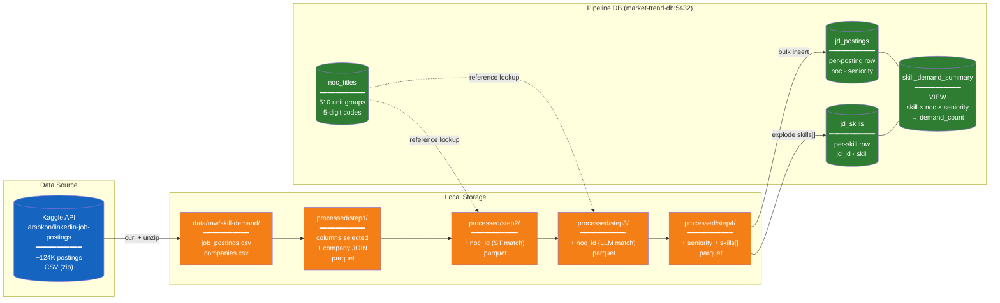
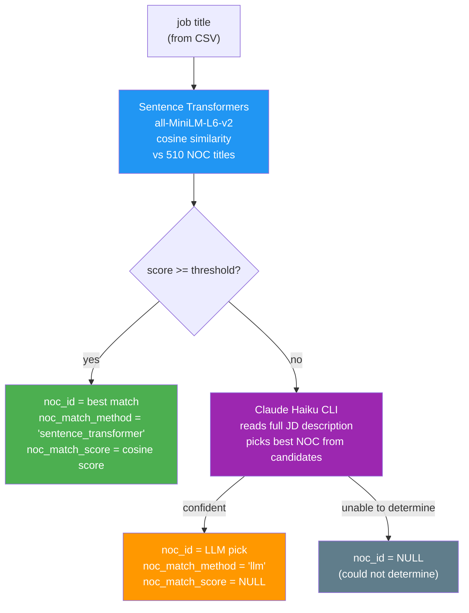

# Skill Demand Pipeline Specification

**Stream Purpose:** Extract and aggregate skill demand from LinkedIn job postings — answer "which skills are most in demand per NOC category and seniority level?" to power the skill analytics feature.

## Data Source

| Property          | Value                                                                                                |
| ----------------- | ---------------------------------------------------------------------------------------------------- |
| Source            | [arshkon/linkedin-job-postings](https://www.kaggle.com/datasets/arshkon/linkedin-job-postings) (Kaggle) |
| Format            | CSV (zip archive, 166.5MB compressed)                                                                |
| Total Postings    | ~124,000                                                                                             |
| Date Range        | 2023–2024                                                                                           |
| License           | CC BY-SA 4.0                                                                                         |
| Processing Engine | PySpark (Spark cluster)                                                                              |
| Raw Data Location | `data/raw/skill-demand/`                                                                           |

### Key Files from Dataset

| File                              | Columns Used                                                                                            | Purpose             |
| --------------------------------- | ------------------------------------------------------------------------------------------------------- | ------------------- |
| `job_postings.csv`              | `job_id`, `title`, `description`, `company_id`, `formatted_experience_level`, `skills_desc` | Main pipeline input |
| `company_details/companies.csv` | `company_id`, `name`                                                                                | Company name lookup |

### Available Columns in `job_postings.csv`

| Column                                         | Type         | Pipeline Usage                                                      |
| ---------------------------------------------- | ------------ | ------------------------------------------------------------------- |
| `job_id`                                     | INT          | Primary key                                                         |
| `title`                                      | TEXT         | NOC normalization input                                             |
| `description`                                | TEXT         | LLM seniority + skill extraction input                              |
| `company_id`                                 | INT          | FK →`companies.csv` for company name                             |
| `formatted_experience_level`                 | TEXT         | Available but not used — LLM extraction from JD is more reliable   |
| `skills_desc`                                | TEXT         | Available but not used — LLM extraction provides structured output |
| `max_salary`, `min_salary`, `pay_period` | NUMERIC/TEXT | Not used in this stream                                             |
| `location`                                   | TEXT         | Not used in this stream                                             |

### Download

Automated via DAG `download` task:

```bash
curl -L -o /tmp/linkedin-job-postings.zip \
  https://www.kaggle.com/api/v1/datasets/download/arshkon/linkedin-job-postings
unzip -o /tmp/linkedin-job-postings.zip -d data/raw/skill-demand/
```

Requires Kaggle API credentials (`~/.kaggle/kaggle.json`).

## Architecture

### DAG-Managed Pipeline

```mermaid
flowchart TB
    classDef process     fill:#dcfce7,stroke:#16a34a,color:#14532d
    classDef resource    fill:#dbeafe,stroke:#2563eb,color:#1e3a8a
    classDef abstraction fill:#ede9fe,stroke:#7c3aed,color:#3b0764
    classDef config      fill:#fef3c7,stroke:#d97706,color:#78350f
    classDef rule        fill:#fce7f3,stroke:#db2777,color:#831843
    classDef validate    fill:#fef9c3,stroke:#ca8a04,color:#713f12

    %% ─── Data Sources ─────────────────────────────────────────
    CSV_RAW[("«resource»<br/>LinkedIn CSV<br/>Kaggle 2023-2024<br/>~124K postings")]:::resource
    NOC_REF[("«resource»<br/>NOC Titles<br/>510 unit groups<br/>5-digit codes")]:::resource

    %% ─── Infrastructure ───────────────────────────────────────
    subgraph Infrastructure["INFRASTRUCTURE"]
        ENSURE_DB["«process»<br/>ensure_db<br/>━━━━━━━━━━━<br/>Start pipeline DB<br/>if not running"]:::process
        ENSURE_SP["«process»<br/>ensure_spark<br/>━━━━━━━━━━━<br/>Start Spark cluster<br/>if not running"]:::process
    end

    %% ─── Prepare ──────────────────────────────────────────────
    subgraph Prepare["PREPARE"]
        DL["«process»<br/>download<br/>━━━━━━━━━━━<br/>Kaggle API<br/>curl + unzip<br/>→ data/raw/"]:::process
        V1{{"«validate» V1<br/>━━━━━━━━━━━<br/>File integrity check<br/>Required columns exist<br/>(company, title, description)"}}:::validate
    end

    D_RAW[("«resource»<br/>Raw CSV<br/>data/raw/skill-demand/")]:::resource

    %% ─── Extract ──────────────────────────────────────────────
    subgraph Extract["EXTRACT"]
        S1["«process»<br/>step1<br/>━━━━━━━━━━━<br/>Select columns<br/>company · title · description"]:::process
        V2{{"«validate» V2<br/>━━━━━━━━━━━<br/>Null check<br/>Duplicate removal<br/>Description min length"}}:::validate
    end

    D_S1[("«resource»<br/>Step 1 Parquet<br/>3 columns · cleaned")]:::resource

    %% ─── Transform: Normalize ─────────────────────────────────
    subgraph Normalize["TRANSFORM: NORMALIZE"]
        S2["«process»<br/>step2<br/>━━━━━━━━━━━<br/>NOC Normalize<br/>Sentence Transformers<br/>cosine similarity"]:::process
        V3{{"«validate» V3<br/>━━━━━━━━━━━<br/>Threshold gate<br/>Match rate check<br/>Split: matched vs sub-threshold"}}:::validate
        S3["«process»<br/>step3<br/>━━━━━━━━━━━<br/>NOC LLM Fallback<br/>Claude Haiku<br/>sub-threshold only"]:::process
        V4{{"«validate» V4<br/>━━━━━━━━━━━<br/>NOC mapping completion rate<br/>Unmapped row count<br/>noc_id NOT NULL check"}}:::validate
    end

    A_ST(["«abstraction»<br/>Sentence Transformers<br/>all-MiniLM-L6-v2<br/>local · ~80MB"]):::abstraction
    A_HAIKU_N(["«abstraction»<br/>Claude Haiku<br/>NOC matching via<br/>JD description"]):::abstraction
    CF_THRESH["«config»<br/>threshold: TBD<br/>(0.7 or 0.8)"]:::config

    D_MATCHED[("«resource»<br/>Matched Parquet<br/>+ noc_id · noc_match_score<br/>method: sentence_transformer")]:::resource
    D_SUB[("«resource»<br/>Sub-threshold Parquet<br/>awaiting LLM fallback")]:::resource
    D_NORMALIZED[("«resource»<br/>Normalized Parquet<br/>all rows with noc_id")]:::resource

    %% ─── Transform: Enrich ────────────────────────────────────
    subgraph Enrich["TRANSFORM: ENRICH"]
        S4["«process»<br/>step4<br/>━━━━━━━━━━━<br/>Extract seniority<br/>+ tech skills<br/>from JD description"]:::process
        V5{{"«validate» V5<br/>━━━━━━━━━━━<br/>Seniority value in allowed set<br/>Skills array not empty<br/>LLM parse error check"}}:::validate
    end

    A_HAIKU_E(["«abstraction»<br/>Claude Haiku<br/>single call per JD<br/>temp: 0"]):::abstraction
    CF_SENIORITY["«config»<br/>seniority tiers:<br/>intern · entry_level<br/>mid_level · senior · executive"]:::config

    D_ENRICHED[("«resource»<br/>Enriched Parquet<br/>+ seniority · skills[]")]:::resource

    %% ─── Load ─────────────────────────────────────────────────
    subgraph Load["LOAD"]
        S5["«process»<br/>step5<br/>━━━━━━━━━━━<br/>Bulk insert<br/>jd_postings + jd_skills"]:::process
    end

    DB_POSTINGS[("«resource»<br/>jd_postings<br/>id · company · raw_title<br/>noc_id · noc_match_score<br/>noc_match_method<br/>seniority · description")]:::resource
    DB_SKILLS[("«resource»<br/>jd_skills<br/>id · jd_id (FK) · skill")]:::resource
    DB_VIEW[("«resource»<br/>skill_demand_summary<br/>VIEW<br/>NOC × seniority × skill<br/>→ demand_count")]:::resource

    STOP["«process»<br/>stop_spark<br/>━━━━━━━━━━━<br/>Shut down<br/>Spark cluster"]:::process

    %% ─── Execution Engine ─────────────────────────────────────
    A_SPARK(["«abstraction»<br/>Apache Spark<br/>UDF distributed processing<br/>Steps 2, 3, 4"]):::abstraction

    %% ─── Main Flow ────────────────────────────────────────────
    ENSURE_DB --> ENSURE_SP
    ENSURE_SP --> DL
    CSV_RAW --> DL
    DL --> V1
    V1 --> D_RAW
    D_RAW --> S1
    S1 --> V2
    V2 --> D_S1
    D_S1 --> S2
    NOC_REF --> S2
    S2 --> V3
    V3 -- "matched" --> D_MATCHED
    V3 -- "sub-threshold" --> D_SUB
    D_SUB --> S3
    S3 --> D_MATCHED
    D_MATCHED --> V4
    V4 --> D_NORMALIZED
    D_NORMALIZED --> S4
    S4 --> V5
    V5 --> D_ENRICHED
    D_ENRICHED --> S5
    S5 --> DB_POSTINGS
    S5 --> DB_SKILLS
    DB_POSTINGS --> DB_VIEW
    DB_SKILLS --> DB_VIEW
    S5 --> STOP

    %% ─── Tool Connections (dotted) ────────────────────────────
    A_ST -. "encode + cosine" .-> S2
    A_HAIKU_N -. "JD → NOC" .-> S3
    A_HAIKU_E -. "JD → seniority + skills" .-> S4
    A_SPARK -. "distributed" .-> S2
    A_SPARK -. "distributed" .-> S3
    A_SPARK -. "distributed" .-> S4

    %% ─── Config Connections (dotted) ──────────────────────────
    CF_THRESH -.- V3
    CF_SENIORITY -.- V5

    %% ─── Link Styles ─────────────────────────────────────────
    %% Infrastructure flow (gray)
    linkStyle 0,1 stroke:#607D8B,stroke-width:2px

    %% Main data flow (blue solid) - links 2~24
    linkStyle 2,3,4,5,6,7,8,9,10,11,12,13,14,15,16,17,18,19,20,21,22,23,24 stroke:#3b82f6,stroke-width:2px

    %% Tool connections (purple dotted) - links 25~30
    linkStyle 25,26,27 stroke:#7c3aed,stroke-width:2px,stroke-dasharray:5
    linkStyle 28,29,30 stroke:#0d9488,stroke-width:2px,stroke-dasharray:5

    %% Config connections (amber dotted) - links 31~32
    linkStyle 31,32 stroke:#d97706,stroke-width:1px,stroke-dasharray:3
```



### Data Flow



### NOC Normalization — Two-Stage Strategy



### Schedule & Config

| Setting                     | Value                                                    |
| --------------------------- | -------------------------------------------------------- |
| Schedule                    | `None` (manual trigger only)                           |
| DAG file                    | `dags/skill_demand_dag.py`                             |
| XCom data                   | File paths only (not DataFrames)                         |
| `MANAGE_PIPELINE_DB=true` | `ensure_db` starts local Docker DB                     |
| `MANAGE_SPARK=true`       | `ensure_spark` / `stop_spark` manage Spark lifecycle |

## Pipeline Steps

### Download — Kaggle Dataset Acquisition (BashOperator)

|             | Value                                                                                               |
| ----------- | --------------------------------------------------------------------------------------------------- |
| Input       | Kaggle API endpoint                                                                                 |
| Output      | `data/raw/skill-demand/job_postings.csv`, `data/raw/skill-demand/company_details/companies.csv` |
| Idempotency | Skip if `job_postings.csv` already exists                                                         |

- BashOperator: `curl -L` + `unzip`
- Requires `~/.kaggle/kaggle.json` credentials in Spark/Airflow container
- Skip download if raw file already present on disk

### Step 1 — Column Extraction + Company JOIN (`src/step1_select_columns.py`)

|         | Value                                                                          |
| ------- | ------------------------------------------------------------------------------ |
| Input   | `data/raw/skill-demand/job_postings.csv` + `company_details/companies.csv` |
| Output  | `processed/step1/*.parquet`                                                  |
| Columns | `job_id`, `company` (from JOIN), `title`, `description`                |

- JOIN `job_postings.csv` → `companies.csv` on `company_id` to resolve company name
- Drop rows with null `title` or `description`
- No transformation — pure extraction + JOIN

### Step 2 — NOC Normalization: Sentence Transformers (`src/step2_noc_normalize.py`)

|               | Value                                                                                      |
| ------------- | ------------------------------------------------------------------------------------------ |
| Input         | Step 1 parquet                                                                             |
| Output        | `processed/step2/*.parquet` (adds `noc_id`, `noc_match_score`, `noc_match_method`) |
| Model         | `sentence-transformers/all-MiniLM-L6-v2` (local, ~80MB, no API)                          |
| NOC Reference | 510 unit group titles (5-digit codes only from `noc_titles`)                             |
| Threshold     | TBD — tuned after first run (starting at 0.75)                                            |

**Why Sentence Transformers over TF-IDF:**

- Semantic understanding: `"Full Stack Developer"` → `"Web designers and developers"` (meaning-based)
- TF-IDF misses this because keywords don't overlap

**Why not LLM for primary matching:**

- 510 NOC titles fit in memory — no search infrastructure needed
- Reproducible scores, no API cost, deterministic output

**Execution:** Spark UDF — NOC vectors broadcast to all workers, each worker encodes job titles locally.

### Step 3 — NOC Normalization: LLM Fallback (`src/step3_noc_llm_fallback.py`)

|         | Value                                                                   |
| ------- | ----------------------------------------------------------------------- |
| Input   | Step 2 parquet (sub-threshold rows only)                                |
| Output  | `processed/step3/*.parquet` (fills in remaining `noc_id`)           |
| Model   | Claude Haiku (Claude CLI subprocess)                                    |
| Context | Full JD description (more context = better decision than title alone)   |
| Pattern | Same as `phase3_map_titles_to_onet_spark.py` — batched, checkpointed |

- Rows already matched in Step 2 are passed through unchanged
- Claude CLI invoked via `subprocess.run(['claude', '--print', '--model', 'haiku', '-'])`
- `HOME=/tmp` for credentials inside Spark worker containers
- Batch-level JSON checkpoints for resume on failure

### Step 4 — Seniority + Skill Extraction (`src/step4_extract.py`)

|          | Value                                                            |
| -------- | ---------------------------------------------------------------- |
| Input    | Step 3 parquet                                                   |
| Output   | `processed/step4/*.parquet` (adds `seniority`, `skills[]`) |
| Model    | Claude Haiku, temperature 0                                      |
| Strategy | Single LLM call per JD extracts both seniority AND skills        |

**Why LLM over existing columns:**

- `formatted_experience_level`: exists in CSV but inconsistent — LLM reading full JD is more reliable
- `skills_desc`: exists as free-text, but LLM extracts structured skill list from full `description`

**Seniority tiers (5 levels):**

| Tier            | Description                       |
| --------------- | --------------------------------- |
| `intern`      | Internship / co-op / student      |
| `entry_level` | 0–2 years, junior, associate     |
| `mid_level`   | 2–5 years, intermediate          |
| `senior`      | 5+ years, senior, lead, principal |
| `executive`   | Director, VP, C-suite             |

**Skills:** LLM extracts all technical skills as lowercase strings from JD text (no predefined list — open extraction).

**Why single call for both:**

- Both need the same JD description as input — no extra cost to extract together
- Halves the number of LLM calls vs separate steps

**Execution:** Spark UDF, batched (batch size TBD), checkpointed per batch.

### Step 5 — DB Load (`src/step5_load.py`)

|        | Value                                                |
| ------ | ---------------------------------------------------- |
| Input  | Step 4 parquet                                       |
| Output | `jd_postings` + `jd_skills` tables in PostgreSQL |

- Bulk insert `jd_postings` (one row per job posting)
- Explode `skills[]` array → bulk insert `jd_skills` (one row per skill per posting)
- `ON CONFLICT DO NOTHING` for idempotent reruns

## Infrastructure

### Required Services

| Service                                | Compose File                    | How it starts                        |
| -------------------------------------- | ------------------------------- | ------------------------------------ |
| Airflow (webserver, scheduler, worker) | `docker-compose.airflow.yml`  | Manual:`./infra/up.sh airflow`     |
| Pipeline DB (port 5432)                | `docker-compose.postgres.yml` | Automatic: DAG `ensure_db` task    |
| Spark master + workers + Livy          | `docker-compose.spark.yml`    | Automatic: DAG `ensure_spark` task |

**Note:** Pipeline DB is shared with the market-trend stream (`noc_titles` table). Skill-demand adds `jd_postings` and `jd_skills` to the same DB.

### Schema Initialization

Skill-demand schema is defined in `infra/init/02-matching-insights.sql`. Runs automatically on fresh volume. To reinitialize:

```bash
./infra/down.sh postgres -v
./infra/up.sh postgres
```

## Output Schema (Database)

### Table: `jd_postings`

| Column               | Type         | Constraint           | Description                                                               |
| -------------------- | ------------ | -------------------- | ------------------------------------------------------------------------- |
| `id`               | SERIAL       | PRIMARY KEY          | Auto-generated                                                            |
| `company`          | VARCHAR(300) |                      | Company name (from companies.csv JOIN)                                    |
| `raw_title`        | VARCHAR(300) | NOT NULL             | Original job title from CSV                                               |
| `noc_id`           | INT          | FK → noc_titles(id) | NULL if no match found                                                    |
| `noc_match_score`  | NUMERIC(4,3) |                      | Cosine similarity score (ST only); NULL for LLM matches                   |
| `noc_match_method` | VARCHAR(30)  |                      | `'sentence_transformer'` or `'llm'`                                   |
| `seniority`        | VARCHAR(50)  | CHECK enum           | `intern` / `entry_level` / `mid_level` / `senior` / `executive` |
| `description`      | TEXT         |                      | Full JD text (kept for re-processing)                                     |

### Table: `jd_skills`

| Column    | Type         | Constraint            | Description                                          |
| --------- | ------------ | --------------------- | ---------------------------------------------------- |
| `id`    | SERIAL       | PRIMARY KEY           | Auto-generated                                       |
| `jd_id` | INT          | FK → jd_postings(id) | Parent posting                                       |
| `skill` | VARCHAR(100) | NOT NULL              | Lowercase skill string (e.g.`"python"`, `"aws"`) |

### View: `skill_demand_summary`

Aggregates skill demand for analytics queries:

```sql
SELECT noc21_name, seniority, skill, demand_count
FROM skill_demand_summary
WHERE noc21_name ILIKE '%software%'
ORDER BY demand_count DESC
LIMIT 20;
```

## Key Technical Decisions

| Decision              | Choice                                           | Rationale                                                                                        |
| --------------------- | ------------------------------------------------ | ------------------------------------------------------------------------------------------------ |
| Data source           | `arshkon/linkedin-job-postings` (Kaggle)       | 124K postings,`title` + `description` + `company_id` in single CSV, 166.5MB zip            |
| Data acquisition      | Kaggle API curl in DAG                           | Automated download, no manual step, idempotent                                                   |
| NOC version           | 2021 (5-digit unit groups only)                  | Current Canadian standard; exclude 6 broad 2-digit categories                                    |
| Primary NOC matching  | Sentence Transformers                            | Semantic similarity, local execution, measurable reproducible scores                             |
| Fallback NOC matching | LLM + full JD description                        | Handles ambiguous titles — full JD gives more context than title alone                          |
| Seniority extraction  | LLM from JD (not `formatted_experience_level`) | CSV field is inconsistent; LLM reading full JD produces reliable 5-tier classification           |
| Skill extraction      | LLM from JD (not `skills_desc`)                | `skills_desc` is free-text; LLM extracts structured lowercase skill list from full description |
| Seniority + skills    | Single LLM call                                  | Both need the same JD input — no reason to call twice                                           |
| Skill storage         | Normalized `jd_skills` table                   | Enables `COUNT(*) GROUP BY skill` without unnesting arrays                                     |
| LLM invocation        | Claude CLI subprocess                            | Subscription-based; same proven pattern as existing phase3 mapping code                          |
| Spark UDF             | Steps 2, 3, 4                                    | Distributes encoding/LLM calls across workers for scale                                          |
| Checkpointing         | Per-batch JSON files                             | Resume interrupted LLM processing without restarting from scratch                                |

## Roadmap

### Phase 1: Pipeline 완성 (현재)

로컬 Docker Compose 환경에서 전체 파이프라인 구현.

| Step | 파일 | 상태 | 설명 |
|------|------|------|------|
| Download | `src/download.py` | ✅ 완료 | Kaggle API curl + unzip, idempotent |
| V1 | `src/validators/v1_download.py` | ✅ 완료 | 파일 존재, 컬럼 검증, row count |
| Step 1 | `src/step1_select_columns.py` | ✅ 완료 | job_id, company_name, title, description 추출 + parquet 저장 |
| V2 | `src/validators/v2_extract.py` | 🔲 다음 | null, 중복 제거, description min length |
| Step 2 | `src/step2_noc_normalize.py` | 🔲 | Sentence Transformers cosine similarity → NOC match |
| V3 | `src/validators/v3_normalize.py` | 🔲 | threshold gate, match rate check |
| Step 3 | `src/step3_noc_llm_fallback.py` | 🔲 | Claude Haiku CLI → sub-threshold NOC match |
| V4 | `src/validators/v4_fallback.py` | 🔲 | NOC mapping completion rate |
| Step 4 | `src/step4_extract.py` | 🔲 | Claude Haiku → seniority + skills[] 추출 |
| V5 | `src/validators/v5_enrich.py` | 🔲 | seniority enum check, skills 비어있지 않은지 |
| Step 5 | `src/step5_load.py` | 🔲 | jd_postings + jd_skills bulk insert |
| DAG | `dags/skill_demand_dag.py` | 🔲 | Airflow DAG (LivyOperator) |
| main.py | `main.py` | ✅ 완료 | CLI orchestrator (pandas, 로컬 테스트용) |

TDD 패턴: `test first (RED) → code (GREEN)` — 각 step마다 테스트 먼저 작성.

테스트 현황: 25 tests passing (download 5 + step1 13 + v1 7)

### Phase 2: AWS 배포 (Terraform)

AWS Academy Learner Lab 환경에 배포. Terraform으로 인프라 코드화.

| 항목 | 로컬 | AWS |
|------|------|-----|
| Airflow | Docker Compose | EC2 + Docker Compose |
| Spark + Livy | Docker Compose | EMR (Livy 내장) |
| Data storage | 로컬 파일 | S3 |
| Infra 관리 | `up.sh` / `down.sh` | `terraform apply` / `terraform destroy` |

핵심: 데이터는 S3에 영속, 인프라는 일회용 (세션마다 recreate).

Terraform 구조: `infra/aws/` — `emr.tf`, `ec2-airflow.tf`, `s3.tf`, `security-groups.tf`

참고 문서:
- `resources/Giljobi-Project/resources/datapipeline/aws-deployment-options.md`
- `resources/Giljobi-Project/resources/datapipeline/spark-job-submission-comparison.md`

### Phase 3: market-trend Spark 전환

Phase 1에서 확립된 Spark 패턴을 market-trend pipeline에 적용.

| 변경 | Before (pandas) | After (PySpark) |
|------|----------------|-----------------|
| Transform | `pandas.read_csv()` + apply | `spark.read.csv()` + UDF + Broadcast Join |
| Load | psycopg2 COPY | Spark JDBC write |
| NOC mapping | dict lookup | Broadcast Join |
| DAG | `@task` decorator | LivyOperator |

market-trend SPEC.md에 Spark Features 섹션 이미 추가됨 — 구현만 하면 됨.
