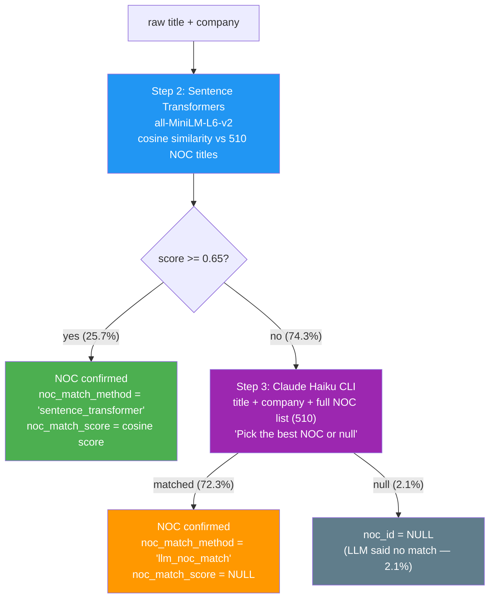

# Skill Demand Pipeline Specification

**Stream Purpose:** Extract and aggregate skill demand from LinkedIn job postings — answer "which skills are most in demand per NOC category and seniority level?" to power the skill analytics feature.

## Data Source

| Property | Value |
|---|---|
| Source | [arshkon/linkedin-job-postings](https://www.kaggle.com/datasets/arshkon/linkedin-job-postings) (Kaggle) |
| Format | CSV (zip archive, 166.5MB compressed) |
| Total Postings | ~124,000 |
| Date Range | 2023–2024 |
| License | CC BY-SA 4.0 |
| Processing Engine | PySpark (Spark cluster) |
| Raw Data Location | `data/raw/skill-demand/` |

### Key Files from Dataset

| File | Columns Used | Purpose |
|------|-------------|---------|
| `postings.csv` | `job_id`, `title`, `description`, `company_name`, `formatted_experience_level` | Main pipeline input |

Note: `company_name` is already in `postings.csv` — no JOIN with `companies.csv` needed.

### Available Columns in `postings.csv`

| Column | Type | Pipeline Usage |
|--------|------|----------------|
| `job_id` | INT | Primary key |
| `title` | TEXT | ST NOC matching + seniority keyword extraction |
| `description` | TEXT | LLM skills extraction input |
| `company_name` | TEXT | LLM context for NOC matching |
| `formatted_experience_level` | TEXT | Seniority 1st priority (76.3% filled) |
| `skills_desc` | TEXT | Not used — LLM extracts structured skills from `description` |

### Download

Automated via DAG `download` task:

```bash
curl -L -o /tmp/linkedin-job-postings.zip \
  https://www.kaggle.com/api/v1/datasets/download/arshkon/linkedin-job-postings
unzip -o /tmp/linkedin-job-postings.zip -d data/raw/skill-demand/
```

Requires Kaggle API credentials (`~/.kaggle/kaggle.json`). Skip if `postings.csv` already exists (idempotent).

## Architecture

### Pipeline Flow

```
Step 1: Extract columns (job_id, company_name, title, description, formatted_experience_level)
  ↓ V1 (file integrity) → V2 (null/length)
Step 2: ST NOC Match (Sentence Transformers, threshold 0.65)
  + Seniority: formatted_experience_level → title keywords → remaining for LLM
  ↓ V3 (match rate)
  ├─ matched (25.7%): NOC + seniority confirmed → Step 4
  └─ unmatched (74.3%): → Step 3
Step 3: LLM NOC Match (Claude Haiku, full NOC list 510개)
  + seniority (if missing) + skills — all in one LLM call
  Adaptive Batch Strategy (company-grouped)
  ↓ V4 (completion rate)
Step 4: LLM Skills Extraction (Step 2 matched only — need skills + missing seniority)
  ↓
Merge: Step 2 matched + Step 3 results + Step 4 results
  ↓
Step 5: DB Load (jd_postings + jd_skills)
```

### DAG Task Flow (Airflow)

```
ensure_db → noc_setup → download → validate_file_integrity → step1_extract → validate_nulls_and_length
  → start_spark_cluster (Master + Livy)
  → start_spark_workers (Workers)
  → step2_noc_match_st → validate_noc_match_rate
  → step3_title_normalize_llm → validate_noc_completion
  → step4 (🔲 구현 예정)
  → stop_spark_workers
  → step5_load
  → stop_spark_cluster
```

### NOC Matching — Two-Stage Strategy

**Why two stages?**
- ST (Sentence Transformers) is fast, free, local — catches obvious matches (25.7%)
- LLM handles the rest with full NOC context — expensive but accurate (72.3% additional)
- Combined: **97.9% NOC coverage** (verified on 721-row sample)



### Design Evolution — What We Tried

Three approaches were tested before the final design:

1. **❌ LLM title normalize → ST re-match** (36.8%)
   - LLM cleaned up titles (e.g. "Unix Manager in Jersey City, NJ" → "IT Manager")
   - Cleaned title re-matched against NOC via ST
   - Problem: LLM doesn't know NOC categories — titles already clean (e.g. "Marketing Analyst") still scored 0.69 vs NOC's long name "Business development officers and market researchers and analysts"

2. **❌ ST with title + JD** (worse than title-only)
   - Hypothesis: JD contains role context → better matching
   - Test result: scores dropped (0.71 → 0.46) — JD noise (benefits, company desc) diluted cosine similarity
   - `all-MiniLM-L6-v2` max 256 tokens → most JD (avg 3768 chars) truncated

3. **✅ LLM with full NOC list** (97.9%)
   - LLM receives: title + company + all 510 NOC categories
   - Picks best match or returns null
   - Simple, accurate, LLM handles semantic understanding

### Schedule & Config

| Setting | Value |
|---------|-------|
| Schedule | `None` (manual trigger only) |
| DAG file | `dags/skill_demand_dag.py` |
| DAG params | `noc_threshold`, `batch_delay_sec`, `step1_input`, executor memory/instances |
| Spark submission | `@task + LivyHook` (real-time log + file-based progress monitoring) |

## Pipeline Steps — Detail

### Step 1 — Column Extraction (`src/step1_select_columns.py`)

| | Value |
|---|---|
| Input | `postings.csv` |
| Output | `processed/step1/step1_extracted.parquet` |
| Columns | `job_id`, `company_name`, `title`, `description`, `formatted_experience_level` |

- Drop rows with null `title` or `description`
- `run()` function saves parquet; `select_columns()` returns DataFrame (for testing)

### Step 2 — NOC Match via Sentence Transformers (`spark/step2_noc_spark.py`)

| | Value |
|---|---|
| Input | Step 1 parquet |
| Output | `processed/step2/step2_normalized.parquet` |
| Model | `sentence-transformers/all-MiniLM-L6-v2` (local, ~80MB, no API) |
| Threshold | 0.65 (configurable via DAG param `noc_threshold`) |

**Why Sentence Transformers over TF-IDF:**
- Semantic understanding: `"Full Stack Developer"` → `"Web designers and developers"` ✅
- TF-IDF misses this because keywords don't overlap

**Why ST is filter, not final matcher:**
- ST scores 0.65-0.69 include correct matches (e.g. "Marketing Analyst" → 0.69) that fail threshold
- NOC titles are long and differently worded — cosine sim has ceiling
- ST catches 25.7% confidently; remaining 74.3% needs LLM semantic judgment

**Seniority extraction in Step 2 (no LLM needed):**

| Priority | Source | Coverage |
|---|---|---|
| 1st | `formatted_experience_level` from CSV | 76.3% (94,440/123,849) |
| 2nd | Title keyword matching | +6.2% (6,192 additional) |
| 3rd | LLM (Step 3 or Step 4) | 18.7% remaining (23,217) |

Title keyword rules:
```
intern:      intern, internship, co-op, coop
entry_level: junior, jr, entry level, entry-level, graduate, trainee
mid_level:   mid level, mid-level, intermediate
senior:      senior, sr, lead, principal, staff
executive:   director, vp, vice president, head of, chief, cto, ceo, cfo
```

`formatted_experience_level` distribution (full dataset):
```
Mid-Senior level    41,489
Entry level         36,708
Associate            9,826
Director             3,746
Internship           1,449
Executive            1,222
Null                29,409
```

**Spark features:**
- `repartition(N)`: distribute across workers
- Broadcast: NOC 510 embeddings sent to all workers
- Chunk encoding: 1000 titles/chunk for progress reporting
- Progress files: worker writes JSON → Airflow reads directly (not via Livy stdout)
- `HF_HUB_DISABLE_PROGRESS_BARS=1`: prevent Livy LineBufferedStream encoding crash

### Step 3 — LLM NOC Match + Seniority + Skills (`spark/step3_title_normalize_llm_spark.py`)

| | Value |
|---|---|
| Input | Step 2 unmatched rows |
| Output | `processed/step3/step3_normalized.parquet` (merged with Step 2 matched) |
| Model | Claude Haiku CLI (subscription, `HOME=/tmp` for credentials) |

LLM prompt includes:
- Company name (context)
- Job title(s)
- Full NOC list (510 categories)
- Request: pick best NOC or null + seniority + skills

`noc_match_method = "llm_noc_match"`, `noc_match_score = None` (LLM doesn't give numeric score)

**Sample results (721 rows):**
```
Total:              721
Step 2 matched:     185 (25.7%) — ST, threshold 0.65
Step 3 matched:     521 (72.3%) — LLM NOC match
Step 3 null:         15 (2.1%) — LLM said no match
Total NOC:          706 (97.9%)
Time:               ~17 minutes
```

#### Adaptive Batch Strategy

LLM calls optimized by company size. Brute force 103K → **1,758 calls (98% reduction)**.

| Company Size | Companies | Strategy | Titles/Call | LLM Calls |
|---|---|---|---|---|
| >=30 titles | 376 | 1 company per call, 50 titles/batch | ~50 | ~653 |
| 10-29 titles | 819 | 2-3 companies per call | 30-57 | ~273 |
| 1-9 titles | 20,653 | Mixed batch, 40 titles/call | ~40 | ~692 |
| **Total** | | | | **~1,758** |

**Brute force comparison:**

| Method | LLM Calls |
|------|-----------|
| Row-by-row | 103,070 |
| Unique (title, company) pair | 81,565 |
| Unique title only | 66,419 |
| Company-by-company | 21,165 |
| **Adaptive Batch** | **1,758** |

**Design rationale:**
- >=30 titles: Large companies (Amazon 286, TEKsystems 395). Company context improves LLM accuracy. Internal 50-title batching.
- 10-29 titles: 2-3 companies per call — still fits in one prompt with company labels.
- 1-9 titles: 20,653 companies, mostly 1-2 titles. Company context adds little value. Batch 40 titles with company name as reference.

**Spark features:**
- `repartition("company_name")`: same company → same worker
- `mapPartitions` + `groupby`: adaptive processing per company size
- Checkpoint: per-company JSON files → resume on failure
- Progress: per-company JSON → Airflow reads directly
- Data-aware Partitioning: processing strategy changes dynamically based on data characteristics

### Step 4 — LLM Skills Extraction (🔲 구현 예정)

| | Value |
|---|---|
| Input | Step 2 matched rows (have NOC + seniority, need skills) |
| Output | Enriched with `skills[]`, missing `seniority` filled |
| Model | Claude Haiku CLI |

Step 2 matched rows already have NOC and seniority but no skills.
LLM reads JD → extracts skills. If seniority missing (18.7%), extracts that too.
Adaptive Batch Strategy reusable.

**Design question (to decide):**
- Can Step 3 prompt (NOC + seniority + skills) be reused for Step 4 (skills + seniority only)?
- Or simpler separate prompt: "Extract skills from this JD"

### Step 5 — DB Load (`src/step5_load.py`)

| | Value |
|---|---|
| Input | Merged parquet (Step 2 matched + Step 3 results + Step 4 results) |
| Output | `jd_postings` + `jd_skills` tables in PostgreSQL |

- Bulk insert `jd_postings` (one row per job posting)
- Explode `skills[]` array → bulk insert `jd_skills` (one row per skill per posting)
- `ON CONFLICT DO NOTHING` for idempotent reruns
- Schema created by `main.py ensure_schema()` or DAG `noc_setup` task

## Infrastructure

### Services

| Service | Compose File | How it starts | Port |
|---|---|---|---|
| Airflow | `docker-compose.airflow.yml` | Manual: `./up.sh airflow` | 8090 |
| Skill-demand DB | `docker-compose.postgres-sd.yml` | DAG: `ensure_db` | 5434 |
| Spark SD Master | `docker-compose.spark-sd.yml` | DAG: `start_spark_cluster` | 8081 |
| Spark SD Workers | `docker-compose.spark-sd.yml` | DAG: `start_spark_workers` | - |
| Livy SD | `docker-compose.spark-sd.yml` | DAG: `start_spark_cluster` | 8999 |

**Separate from matching-insights:** Dedicated Spark cluster (`giljobi-spark-sd`) with:
- `spark-worker-sd/Dockerfile`: Python 3.11 + sentence-transformers + PyTorch + Claude CLI + Node.js
- `livy-sd/Dockerfile`: Same packages for driver + `JAVA_TOOL_OPTIONS="-Dfile.encoding=UTF-8"`

**Spark lifecycle in DAG (resource management):**
```
start_spark_cluster (Master + Livy only)
  → start_spark_workers (Workers — alive only during Spark jobs)
    → [Step 2 + Step 3 Spark jobs]
  → stop_spark_workers (free resources)
  → [Step 5 DB load — no Spark needed]
→ stop_spark_cluster (cleanup)
```

### Monitoring

| Source | What it shows | How |
|---|---|---|
| Airflow task log | Driver stdout + progress | `@task + LivyHook` polling (Livy log + file read) |
| Worker progress files | Rows processed, matched count | Workers write JSON → Airflow reads directly |
| Spark Master UI (:8081) | Worker status, executors | Browser |
| Spark App UI (:4040) | Job/stage/task progress | Browser (during job only) |

**Why not Livy stdout for progress:**
- Accumulator: lazy — values update only after `collect()` completes
- Threading print: Livy `LineBufferedStream` doesn't capture from non-main threads during `collect()` block
- Solution: Workers write files to shared volume, Airflow reads directly in polling loop

## DB Schema

### Table: `jd_postings`

| Column | Type | Constraint | Description |
|---|---|---|---|
| `id` | SERIAL | PRIMARY KEY | Auto-generated |
| `company` | VARCHAR(300) | | Company name |
| `raw_title` | VARCHAR(300) | NOT NULL | Original job title |
| `noc_id` | INT | FK → noc_titles(id) | NULL if no match (2.1%) |
| `noc_match_score` | NUMERIC(4,3) | | ST cosine score; NULL for LLM |
| `noc_match_method` | VARCHAR(30) | | `sentence_transformer` or `llm_noc_match` |
| `seniority` | VARCHAR(50) | CHECK enum | intern/entry_level/mid_level/senior/executive |
| `description` | TEXT | | Full JD text |

### Table: `jd_skills`

| Column | Type | Constraint | Description |
|---|---|---|---|
| `id` | SERIAL | PRIMARY KEY | |
| `jd_id` | INT | FK → jd_postings(id) | |
| `skill` | VARCHAR(100) | NOT NULL | Lowercase (e.g. "python", "aws") |

### View: `skill_demand_summary`

```sql
SELECT noc21_name, seniority, skill, demand_count
FROM skill_demand_summary
WHERE noc21_name ILIKE '%software%'
ORDER BY demand_count DESC
LIMIT 20;
```

## Key Technical Decisions

| Decision | Choice | Rationale |
|---|---|---|
| Data source | `arshkon/linkedin-job-postings` (Kaggle) | 124K postings, single CSV with all needed columns |
| NOC primary match | Sentence Transformers (0.65) | Fast, free, local. Filters 25.7% confidently |
| NOC fallback | LLM with full NOC list (510) | 97.9% total. Tried: normalize+re-match (36.8%), ST+JD (worse) |
| Seniority | 3-tier: CSV (76.3%) → keyword (6.2%) → LLM (18.7%) | Minimize LLM usage |
| Skills | LLM from JD | No alternative — JD parsing required |
| Batch strategy | Adaptive by company size | 98% reduction (103K → 1,758 calls) |
| Spark submission | `@task + LivyHook` | Real-time log (vs LivyOperator state-only) |
| Progress | Airflow reads worker files directly | Livy stdout unreliable (encoding/threading/blocking) |
| Spark infra | Separate cluster (`spark-sd`) | Different packages than matching-insights |
| LLM auth | `~/.claude:/tmp/.claude` mount, `HOME=/tmp` | Claude CLI subscription credentials |

## Roadmap

### Phase 1: Pipeline (current)

| Step | Status | Note |
|---|---|---|
| Download | ✅ | Kaggle API, idempotent |
| V1, V2 | ✅ | File integrity, null/length |
| Step 1 | ✅ | Column extraction + parquet |
| Step 2 | ✅ | ST NOC match (0.65) + seniority (CSV + keyword) |
| V3 | ✅ | Match rate stats |
| Step 3 | ✅ | LLM NOC match + Adaptive Batch (97.9% on sample) |
| V4 | ✅ | Completion rate (97.9%) |
| **Step 4** | **🔲** | **Skills extraction + remaining seniority — redesign in progress** |
| V5 | ✅ | Seniority/skills validation (code ready) |
| Step 5 | 🔲 | DB load (path update needed for new flow) |
| DAG | ✅ | Full orchestration with resource lifecycle |
| Infra | ✅ | Separate Spark-SD cluster |
| Tests | 133 passing | |

### Phase 2: AWS (Terraform)

EC2 (Airflow Docker Compose) + EMR (Spark+Livy built-in) + S3 (data).
`terraform apply` → create all → work → `terraform destroy` → cost zero.
See: `resources/datapipeline/aws-deployment-options.md`

### Phase 3: market-trend Spark migration

Apply same Spark patterns (Broadcast Join, UDF, Partitioned Write, Accumulator) to market-trend pipeline.
See: `pipelines/market-trend/SPEC.md` Spark Features section.

## Reference Documents

- `resources/datapipeline/spark-cluster-architecture.md` — Spark architecture with mermaid diagrams
- `resources/datapipeline/spark-job-submission-comparison.md` — Livy vs SparkSubmit + LivyHook architecture change
- `resources/datapipeline/aws-deployment-options.md` — AWS Academy deployment + Terraform
